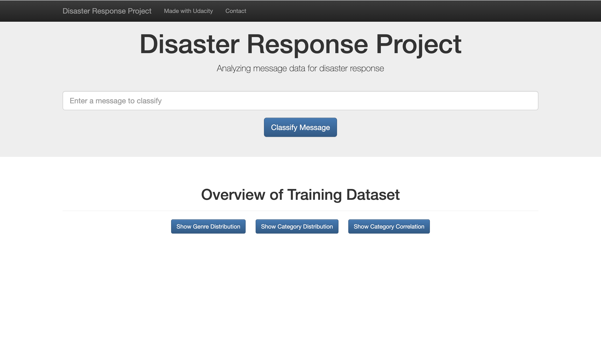
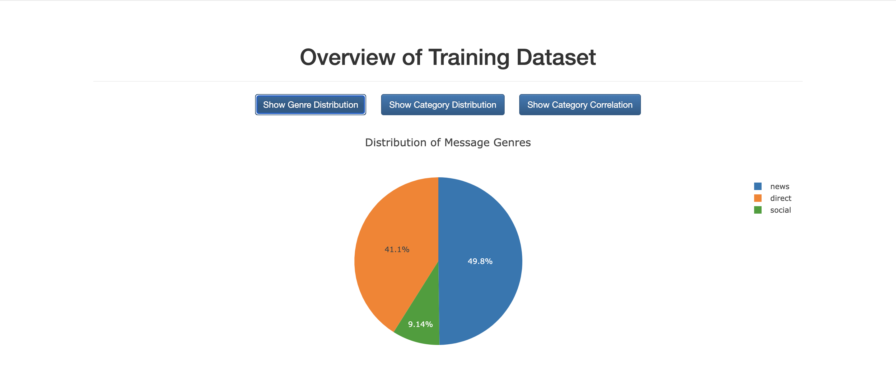
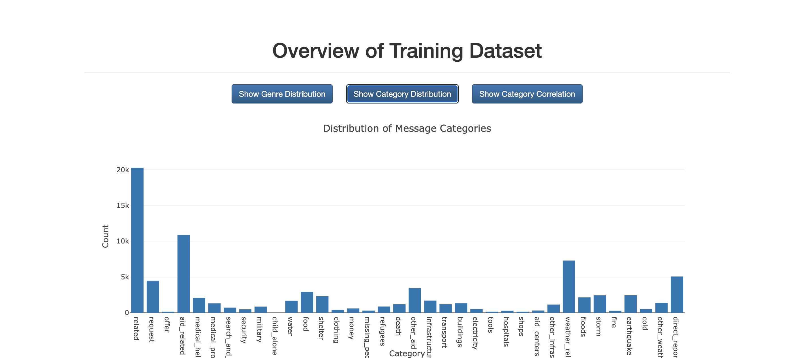
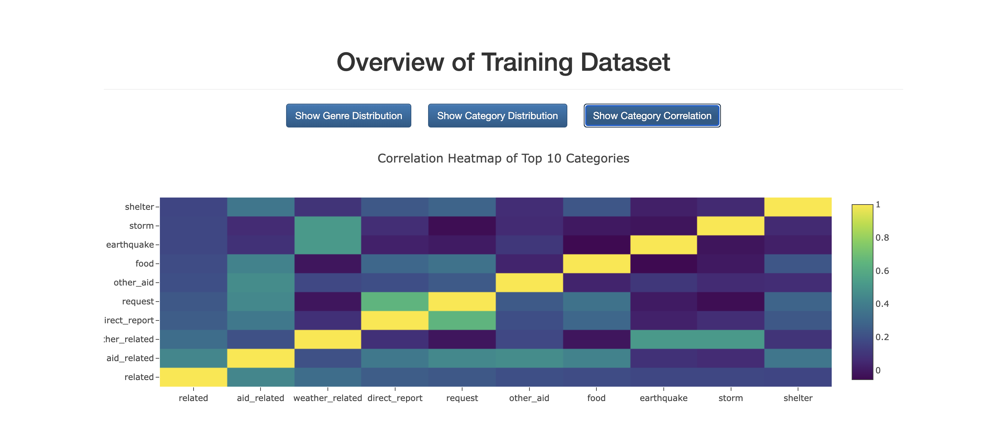
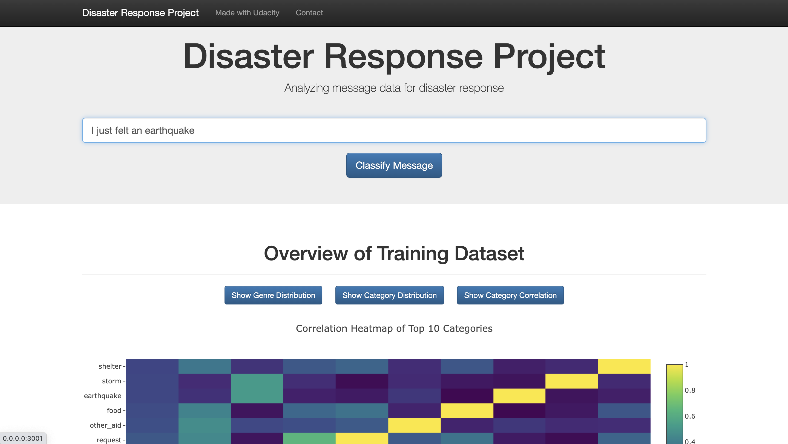
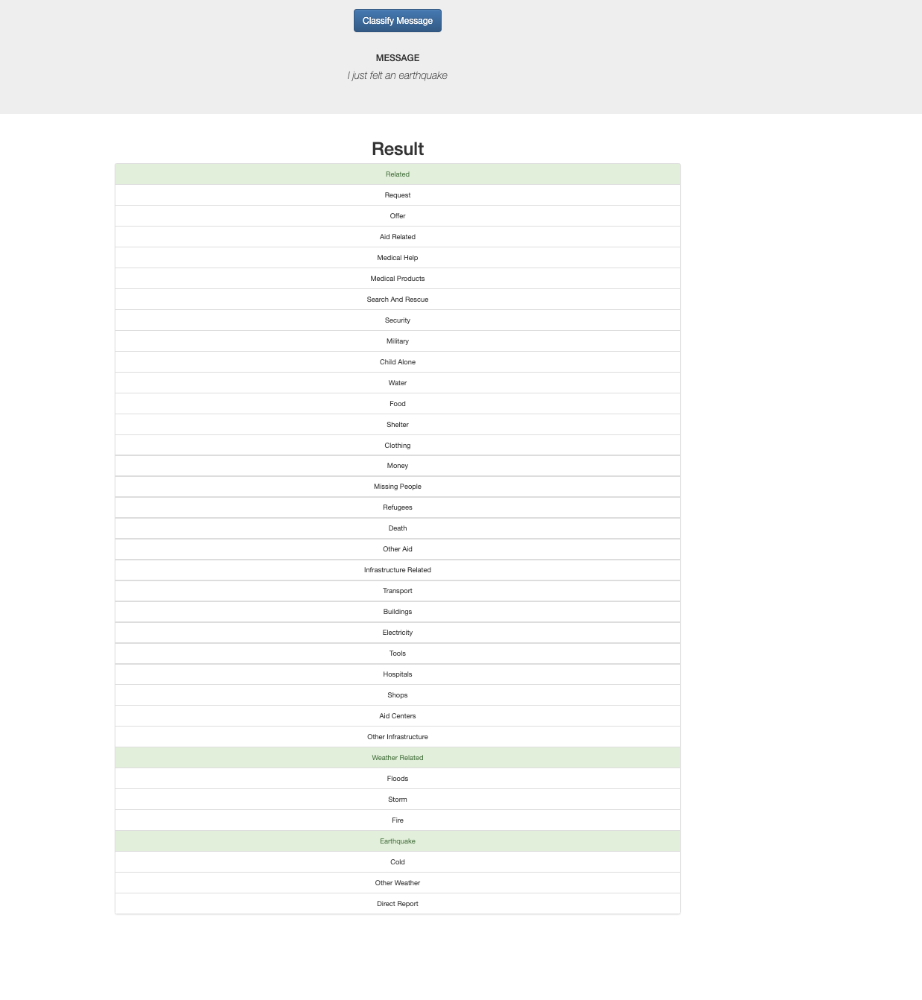

# Disaster Response Pipeline Project

## Table of Contents
- [Description](#description)
- [Project Structure](#project-structure)
- [Instructions](#instructions)
- [Dependencies](#dependencies)
- [Technical Details](#technical-details)
- [Screenshots](#screenshots)
- [Acknowledgements](#acknowledgements)
- [Licensing](#licensing)

## Description
This is a Disaster Response Web App that can classify messages related to disasters into various categories. It provides insights into disaster response and allows users to input messages for classification.

## Project Structure

The project is structured as follows:

- **app**
  - Contains web application templates.
  - `master.html`: Main page of the web app.
  - `go.html`: Classification result page of the web app.

- **data**
  - Contains data to process.
  - `disaster_categories.csv`: Data file with category information.
  - `disaster_messages.csv`: Data file with messages to classify.
  - `process_data.py`: Python script for data processing.
  - `InsertDatabaseName.db`: Database to save clean data.

- **models**
  - Contains machine learning models.
  - `train_classifier.py`: Python script for training a classification model.
  - `classifier.pkl`: Saved machine learning model.

- **README.md**: The document you're currently reading.

## Instructions

To run the Disaster Response Web App, follow these steps:

1. Data Processing:
   - Navigate to the `data` directory.
   - Run `process_data.py` to clean and store the data in the database.
   - `python data/process_data.py data/disaster_messages.csv data/disaster_categories.csv data/DisasterResponse.db`

2. Model Training:
   - Navigate to the `models` directory.
   - Run `train_classifier.py` to train the model and save it as `classifier.pkl`.
   -  `python models/train_classifier.py data/DisasterResponse.db models/classifier.pkl`

3. Running the Web App:
   - Execute `run.py` in the project's root directory.
   -  `python run.py`
   - Access the web app via your web browser.
   - Go to http://0.0.0.0:3001/
   - Note that in some instances it can take upto 20 seconds for the homepage to load.
   
4. Web App:
   - Input a message in the main page and click "Classify Message" to see the classification results.
   - The web app displays visualization and classification results.

## Dependencies
The project relies on the following dependencies:

- Python
- Flask
- Plotly
- pandas
- numpy
- scikit-learn
- NLTK
- sqlalchemy

## Technical Details

**Data Processing (ETL):**

- Data Cleaning:
    - Initially, the two datasets were merged into a DataFrame (df) using the "id" as the common key.
    - The categories were separated into distinct category columns.
    - To facilitate processing, category values were transformed into binary values (0 or 1).
    - The original categories column in df was substituted with the newly created category columns.
    - Duplicate entries were eliminated by assessing the message column for redundancy.
    - The resulting clean DataFrame (df) was then exported to an DisasterResponse.db database.

**About the ML Pipeline:**

- The machine learning pipeline employed for message classification consists of the following steps:

    - A tokenization function was developed to preprocess text data.
    - A machine learning pipeline was constructed using CountVectorizer, TfidfTransformer, and MultiOutputClassifier(RandomForestClassifier()).
    - The dataset was divided into training and test sets.
    - The pipeline was used to train and assess a basic RandomForestClassifier.
    - Hyperparameter optimization with 3-fold cross-validation (default cv) was performed using GridSearchCV to identify the most effective model for classifying disaster response into categories.
    - The best parameters for the pipeline were determined as {'clf__estimator__max_depth': None, 'clf__estimator__n_estimators': 100} Setting the n estimator to 50 can help with runtimes (Approx runtime with GridSearch is ~15 mins).
    - We can see from below screenshot of Category distribution that some categoris have fewer training samples. When dealing with imbalanced classes characterized by fewer samples, the model's ability to generalize effectively becomes compromised. This can be reflected in the results of the model. 
- Refer results folder for category wise F1, Precision and Recall.

## Screenshots

*Homepage*

*Genre Distribution*

*Category Distribution*

*Category Correlation*

*Query*

*Classification Results*

## Acknowledgements
- The project uses data provided by [Figure Eight](https://www.figure-eight.com/).
- Thanks to Udacity Datascientist Nanodegree course work, from which some snippets of code/ technique and inspiration for techniques used have been used in this project.

## Licensing
This project is licensed under the terms of the MIT license.